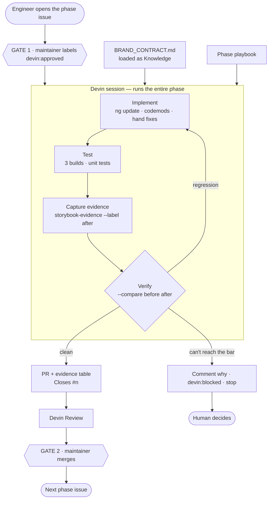
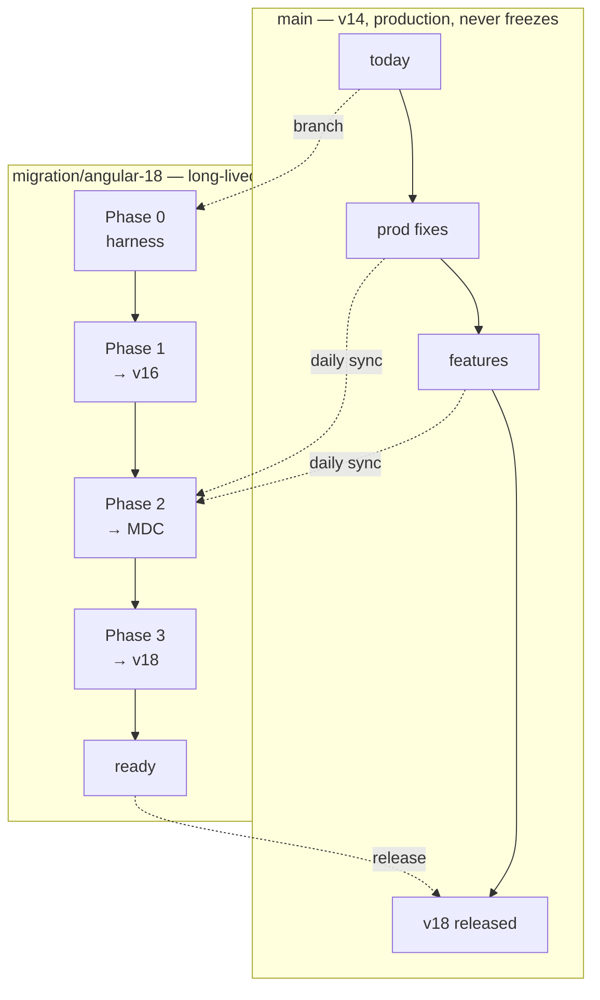

# Angular 14 → 18 migration: automation architecture

**A human triggers a phase. The automation runs the whole phase — implementation, tests,
verification, evidence — and comes back with a PR.** The human reviews, merges, and triggers the
next one.

The repo is the control plane: the trigger (an issue), the constraints (`BRAND_CONTRACT.md`), the
code, the evidence and the audit trail all live in one place. No external work tracker to keep in
sync.

---

## 1. The loop



Two properties worth naming:

**Constraints are data, not prompt.** The contract is a file in the repo loaded as Knowledge, so
changing a brand rule is a reviewed commit and every PR records the revision it was checked against.

**Devin never opens a green-looking PR it can't back.** If it can't hit the phase's done-when, it
comments why and stops rather than shipping something that merely compiles.

---

## 2. The four phases

| # | Phase | What it does | Why it's one unit |
|---|---|---|---|
| **0** | **Harness** | Storybook, stories for all 3 components, axe, evidence tool, CI, `before` baseline on v14 | Nothing migrates. Without this there's no "before" to verify against |
| **1** | **Walk to v16** | 14→15→16 across all 3 projects; **remove `@angular/flex-layout`**; fix the theme path `ng update` leaves behind | Version bumps are whole-workspace; nothing to split |
| **2** | **Legacy → MDC** | Theme migration + all 3 components; resolve `TODO(mdc-migration):`; before/after diffs | The real work. The only phase with intentional visual change |
| **3** | **v16 → v18** | Through the v17 gate (legacy deleted), esbuild builder, control flow, RxJS cleanup | Whole-workspace again; must be visually inert |

**Phase 1 is not optional cleanup.** `@angular/flex-layout` is archived with no v15+ release, so it
hard-blocks the walk. `dashboard.component.html` uses `fxLayout`, `fxLayoutGap`, `fxFlex` and
`fxLayout.lt-md` — all of it becomes CSS grid/flex in this phase.

**Phase 2 is the only phase where pixels are supposed to move.** That distinction is what makes
Phase 3 verifiable: it must be pixel-identical to the end of Phase 2, so `--strict-pixels` applies.

---

## 3. Verifying success

Five checks, weakest to strongest. All five run inside the session before the PR opens, and again in
CI.

| # | Check | Catches | Gate? |
|---|---|---|---|
| 1 | All 3 projects build | Compile errors | yes — necessary, near-worthless alone |
| 2 | Unit tests pass | Logic regressions | yes — weak here; 3 spec files exist |
| 3 | Every story still renders | A component silently dying | **yes** |
| 4 | No new axe violations | Lost labels, roles, contrast | **yes**, regression-gated |
| 5 | Property assertions | Lost accessible name, target <24px, contrast <4.5:1 | **yes** |
| — | Pixel diff | Where the layout moved | triage in Phase 2, **gate in Phase 3** |

### Why the pixel diff isn't the gate

MDC intentionally changes the DOM and CSS of every component, so in Phase 2 every story
legitimately moves. A "no pixels changed" rule would flag 100% of the work and get ignored within a
day. What the diff gives you is *attention*: a percentage and a highlighted diff image saying
"look here". A 4% diff on a button's bottom edge is padding; 40% means something structural.

What stays machine-enforceable across an intentional redesign is **properties measured from the
rendered page** — accessible name present, bounding box ≥24×24, computed contrast of actual
foreground against actual background. Those survive a visual change; pixels don't.

### Check 3 is subtler than it looks

If a component stops rendering, checks 1 and 2 stay green *and check 4 also looks green* — a blank
page has no accessibility violations. So the comparison explicitly fails when a story present in the
`before` set is missing from the `after` set, and when a story's control count drops.

### The commands

```bash
npm run build-storybook
node tools/storybook-evidence.mjs --label before      # on the pre-phase commit
# ... phase work ...
npm run build-storybook
node tools/storybook-evidence.mjs --label after
node tools/storybook-evidence.mjs --compare before after [--strict-pixels]
```

The comparison prints the markdown table that goes straight into the PR body and exits non-zero on
any regression. The phase's done-when is a command, not a judgement call.

---

## 4. What Phase 0 already found

The harness ran against untouched v14 — 15 stories, 3 components — before any migration:

| Finding | Detail |
|---|---|
| **11 × `button-name`, critical** | `bds-button` declares three `<ng-content>` slots. Angular projects into one, so **only `variant="danger"` renders its label** — primary and secondary buttons are blank boxes with no accessible name. The dashboard's "Transfer Funds" and "View Statements" are affected |
| **2 × `color-contrast`, serious** | The `warning` alert at `#B26A00` on `#FCF1E0` measures 3.79:1 against a 4.5:1 floor |

Both build green and pass the existing tests. That's the argument for the harness: neither is
findable by compiling, and the button bug isn't findable by a pixel diff either.

Per contract rule **D4** these are filed as issues, not fixed inside a migration PR. They're
pre-existing, so the bar for every later phase is "no worse" rather than "clean".

---

## 5. Branch topology

Production can't freeze, so two branches run in parallel and reconcile daily.



The daily sync is a scheduled session. It merges `main` in, resolves clerical conflicts (imports,
lockfiles, adjacent-line edits) and opens a PR. When a conflict is substantive — a component
refactored on `main` and migrated on the branch — it stops and files an issue rather than guessing.
That escalation path is the only reason it's safe to leave running unattended.

---

## 6. The human gates

| Gate | Where | Enforced by |
|---|---|---|
| 1 · May this phase start? | `devin:approved` on the phase issue | Label permission — maintainers only |
| 2 · May this merge? | PR approval | Branch protection; Devin never merges its own work |
| 3 · What now? | `devin:blocked` + a comment explaining why | Devin stops; a human decides |

Three labels total: `migration`, `devin:approved`, `devin:blocked`. Agents produce artifacts, humans
approve them, every action is logged against an issue number.

---

## 7. State of the repo

| Piece | Status |
|---|---|
| `BRAND_CONTRACT.md` + `AGENTS.md` | done |
| Issue templates, labels, PR template | done |
| Storybook + 15 stories + axe addon | done, builds clean on v14 |
| `tools/storybook-evidence.mjs` | done — screenshots, axe, property measurement, pixel diff |
| `before` baseline captured on v14 | done |
| CI workflow | to do |
| `migration/angular-18` branch | to do |
| Phases 1 and 3 pre-run | to do |
| **Phase 2 left as the live demo trigger** | — |
| Push access to the repo | **blocked — 403, read-only** |

## 8. The demo

Pre-run phases 0, 1 and 3 so their PRs exist and can be read. Leave **Phase 2** as the live beat:
open the issue, let Devin post its plan, apply `devin:approved`, watch it start — then cut to the
finished PR with the before/after table rather than watching a build.

Phase 2 is the right one to keep live because it's the only phase that's about Angular Material
rather than version numbers, and it's where the before/after evidence actually pays off.
