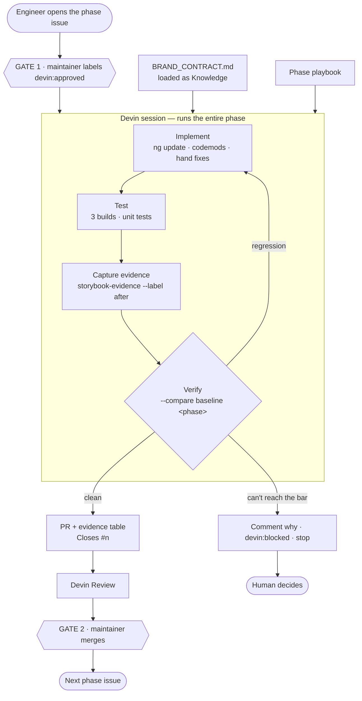
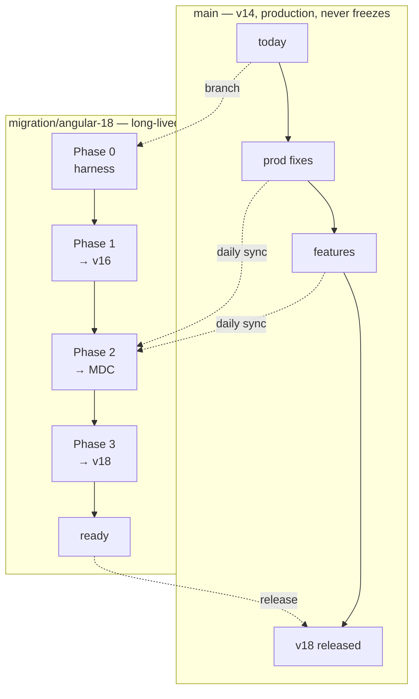

# Angular 14 → 18 migration: automation architecture

**A human triggers a phase. The automation runs the whole phase — implementation, tests,
verification, evidence — and comes back with a PR.** The human reviews, merges, and triggers the
next one.

The repo is the control plane: the trigger (an issue), the constraints (`BRAND_CONTRACT.md`), the
code, the evidence and the audit trail all live in one place. No external work tracker to keep in
sync.

---

## 1. The loop



Two properties worth naming:

**Constraints are data, not prompt.** The contract is a file in the repo loaded as Knowledge, so
changing a brand rule is a reviewed commit and every PR records the revision it was checked against.

**Devin never opens a green-looking PR it can't back.** If it can't hit the phase's done-when, it
comments why and stops rather than shipping something that merely compiles.

---

## 2. The four phases

| # | Phase | What it does | Why it's one unit |
|---|---|---|---|
| **0** | **Harness** | Storybook and stories for all 3 components, axe, evidence tool, API and dependency reports, CI, the `v14` baseline | Nothing migrates. Without it there is no before-state to verify against, and no baseline can be recovered once a version moves |
| **1** | **Walk to v16** | 14→15→16 across all 3 projects; **remove `@angular/flex-layout`**; fix the theme path `ng update` leaves behind | Version bumps are whole-workspace; nothing to split |
| **2** | **Legacy → MDC** | Theme migration + all 3 components; resolve `TODO(mdc-migration):`; before/after diffs | The real work. The only phase with intentional visual change |
| **3** | **v16 → v18** | Through the v17 gate (legacy deleted), esbuild builder, control flow, RxJS cleanup | Whole-workspace again; must be visually inert |

**Phase 1 is not optional cleanup.** `@angular/flex-layout` is archived with no v15+ release, so it
hard-blocks the walk. `dashboard.component.html` uses `fxLayout`, `fxLayoutGap`, `fxFlex` and
`fxLayout.lt-md` — all of it becomes CSS grid/flex in this phase.

**Phase 2 is the only phase where pixels are supposed to move.** That distinction is what makes
Phase 3 verifiable: it must be pixel-identical to the end of Phase 2, so `--strict-pixels` applies.

### How each phase splits into PRs

A phase is one tracking issue and several PRs. **The axis it splits along is not the same in every
phase**, which is the part most likely to be got wrong.

Version walks split **by version step, not by project**. `package.json` and the lockfile are single
files, and there is no way to bump Angular for the library but not its two consumers — the workspace
wouldn't build. Those PRs are necessarily stacked and merge in order.

Only the MDC phase splits **by component**, and even there the theme has to land first because
everything else depends on it.

| Phase | PRs | Target | Order |
|---|---|---|---|
| 0 | contract + workflow · Storybook + stories · evidence tool + baseline + CI | `main` | stacked |
| 1 | remove `@angular/flex-layout` · 14→15 · 15→16 | `migration/angular-18` | stacked |
| 2 | Material theme · `bds-button` · `bds-card` · `bds-alert-banner` · shell · advisor-console | `migration/angular-18` | theme first, then the rest in parallel |
| 3 | 16→17 · 17→18 · esbuild + control flow | `migration/angular-18` | stacked |

The three component PRs in Phase 2 are the only genuinely parallel work in the whole migration —
independent of each other, one session each. Everything else is serial, and it's worth being precise
about that rather than claiming the migration parallelises.

`migration/angular-18` is the integration branch. A phase is finished when every box on its tracking
issue is checked; nothing from the next phase branches until then, and the branch doesn't go near
`main` until Phase 3 is complete.

---

## 3. Verifying success

Seven checks, weakest to strongest. All of them run inside the session before the PR opens, and
again in CI.

| # | Check | Catches | Gate? |
|---|---|---|---|
| 1 | All 3 projects build | Compile errors | yes — necessary, near-worthless alone |
| 2 | Unit tests pass | Logic regressions | yes — weak here; 3 spec files exist |
| 3 | Every story still renders | A component silently dying | **yes** |
| 4 | No new axe violations | Lost labels, roles, contrast | **yes**, regression-gated |
| 5 | Property assertions | Lost accessible name, target <24px, contrast <4.5:1 | **yes** |
| 6 | Public API surface unchanged | A breaking change leaking to consumers | **yes**, or argued on the PR |
| 7 | No new runtime advisory | The migration worsening the shipped posture | **yes** — production closure only |
| — | Pixel diff | Where the layout moved | triage in Phase 2, **gate in Phase 3** |
| — | Dependency tree diff | What the version walk actually pulled in | review artifact |

### Why the pixel diff isn't the gate

MDC intentionally changes the DOM and CSS of every component, so in Phase 2 every story
legitimately moves. A "no pixels changed" rule would flag 100% of the work and get ignored within a
day. What the diff gives you is *attention*: a percentage and a highlighted diff image saying
"look here". A 4% diff on a button's bottom edge is padding; 40% means something structural.

What stays machine-enforceable across an intentional redesign is **properties measured from the
rendered page** — accessible name present, bounding box ≥24×24, computed contrast of actual
foreground against actual background. Those survive a visual change; pixels don't.

### Check 3 is subtler than it looks

If a component stops rendering, checks 1 and 2 stay green *and check 4 also looks green* — a blank
page has no accessibility violations. So the comparison explicitly fails when a story present in the
baseline set is missing from the new set, and when a story's control count drops.

### Check 6 exists because "both apps build" is not a consumer guarantee

The two apps in this workspace compile against the library's *source*. A real consuming team
compiles against its published `.d.ts`, and it is the template-facing surface — selector, inputs,
outputs, content slots — that `ng update` and the MDC schematics rewrite. Angular's compiler
encodes all of it in the emitted `ɵcmp` declaration, so `api-report/bofa-design-system.api.md` is
generated from the built types rather than hand-maintained.

The entire premise of BDS is that it absorbs Material's churn so downstream teams don't feel it.
That premise is testable, and this is the test: **a diff in that file is a migration leak until
someone argues otherwise.**

### Check 7 separates what ships from what builds

On untouched v14 the workspace reports 85 advisories. Counting them as one number is how a real
finding gets lost, so the gate only covers the production dependency closure — what a browser
actually receives. Build-time advisories are reported and not gated.

### The baseline is promoted, not frozen

An earlier version of this plan said the `before` baseline must never be regenerated. That is right
within a migration and wrong across migrations: 18→19's before-state is this migration's
after-state, and a frozen baseline would make the harness single-use. `baseline` now resolves
through `.storybook-evidence/baseline.json`, and completing a migration ends with promoting the
final capture.

### The commands

```bash
npm run build-storybook
npm run evidence -- --label <phase>
npm run evidence -- --compare baseline <phase> [--strict-pixels]
npm run api-report -- --check
npm run deps-report -- --check

# at the end of a migration, so the next one has something to measure against
npm run evidence -- --promote v18 --note "Angular 18 / Material 18 MDC"
```

Each prints the markdown that goes straight into the PR body and exits non-zero on any regression.
The phase's done-when is a command, not a judgement call.

---

## 4. What Phase 0 already found

The harness ran against untouched v14 — 15 stories, 3 components — before any migration:

| Finding | Detail |
|---|---|
| **11 × `button-name`, critical** | `bds-button` declares three `<ng-content>` slots. Angular projects into one, so **only `variant="danger"` renders its label** — primary and secondary buttons are blank boxes with no accessible name. The dashboard's "Transfer Funds" and "View Statements" are affected |
| **2 × `color-contrast`, serious** | The `warning` alert at `#B26A00` on `#FCF1E0` measures 3.79:1 against a 4.5:1 floor |
| **`<bds-button>` declares 3 content slots** | The same defect from the API side. Visible in `api-report/` as `Content slots: *, *, *` — which is why the API report is worth reading, not just diffing |
| **11 high-severity runtime advisories** | All in `@angular/*` itself: XSS in `core` and `compiler`, XSRF token leakage and cache poisoning in `common`. None are patchable on v14 |

All of it builds green and passes the existing tests. That's the argument for the harness: none is
findable by compiling, and the button bug isn't findable by a pixel diff either.

Per contract rule **D4** the defects are filed as issues, not fixed inside a migration PR. They're
pre-existing, so the bar for every later phase is "no worse" rather than "clean".

**The advisories are a different kind of finding.** They aren't a defect to file — they're the
business case. Angular 14 left LTS in November 2023, so those 11 have no patch on this version and
the version walk *is* the remediation. This reframes the programme from deferrable tech debt to an
unpatched runtime XSS surface with a known fix, which is the framing a bank's risk function
responds to.

---

## 5. Branch topology

Production can't freeze, so two branches run in parallel and reconcile daily.



The daily sync is a scheduled session. It merges `main` in, resolves clerical conflicts (imports,
lockfiles, adjacent-line edits) and opens a PR. When a conflict is substantive — a component
refactored on `main` and migrated on the branch — it stops and files an issue rather than guessing.
That escalation path is the only reason it's safe to leave running unattended.

---

## 6. The human gates

| Gate | Where | Enforced by |
|---|---|---|
| 1 · May this phase start? | `devin:approved` on the phase issue | Label permission — maintainers only |
| 2 · May this merge? | PR approval | Branch protection; Devin never merges its own work |
| 3 · What now? | `devin:blocked` + a comment explaining why | Devin stops; a human decides |

Three labels total: `migration`, `devin:approved`, `devin:blocked`. Agents produce artifacts, humans
approve them, every action is logged against an issue number.

---

## 7. What makes the next migration cheaper than this one

The point isn't to reach v18. It's that 18→19 should cost a fraction of 14→18, and that the same
harness should work on the next Angular library the bank owns. Four things carry over:

| Carries over | How |
|---|---|
| The verifier | `tools/*.mjs` are workspace-agnostic — they read the built Storybook, the built `.d.ts` and the lockfile, not anything specific to this migration |
| The baseline | Promoted at the end of each migration, so the next one starts with a before-state instead of having to invent one |
| The procedure | `AGENTS.md` + the playbook. Step 5 requires each phase to write back what it learned, so the trap list grows instead of being rediscovered |
| The gates | The issue template, the labels and the PR checklist are the process, and they're versioned with the code |

**Step 5 is the one that decays if it's skipped.** Every phase turns up something the docs didn't
predict — a schematic that rewrites the wrong file, an estimate that was wrong by 3×. If that goes
into `BRAND_CONTRACT.md` or `AGENTS.md` in the phase's last PR, the next migration is cheaper. If it
stays in a session transcript, it isn't.

### Where Devin's capabilities attach

| Capability | Where it earns its keep here |
|---|---|
| Issue triage | Reading the code to produce the costed plan, so approval is priced rather than vague |
| One session per phase | Implementation, tests and evidence in one loop, ending at a PR it can defend |
| **MultiDevin** | Phase 2's three component PRs — the only genuinely parallel work in the whole migration, since version steps are strictly sequential |
| Scheduled sessions | The daily `main` → `migration/angular-18` sync, escalating substantive conflicts instead of guessing |
| Devin Review | First-pass review on every PR. Worth being straight about: on Devin-authored PRs this is not an independent gate. The load-bearing checks are the measured ones and the human merge |
| Knowledge + playbooks | The contract and the phase procedure loaded every session, so behaviour doesn't depend on who typed the prompt |

Being precise about the parallelism matters: "we parallelize the migration" invites "how?", and the
honest answer is narrow-wide-narrow — only the middle phase fans out. That's still most of the
effort.

---

## 8. State of the repo

| Piece | Status |
|---|---|
| `BRAND_CONTRACT.md` + `AGENTS.md` | done |
| Issue templates, labels, PR template | done |
| Storybook + 15 stories + axe addon | done, builds clean on v14 |
| `tools/storybook-evidence.mjs` | done — screenshots, axe, property measurement, pixel diff |
| `tools/api-surface.mjs` + `api-report/` | done — generated from the built `.d.ts`, gated in CI |
| `tools/dependency-report.mjs` + `deps-report/` | done — tree diff, runtime vs build-time advisories |
| `v14` baseline + promote step | done |
| CI workflow | done — build, test, API, dependencies, evidence |
| `migration/angular-18` branch | done |
| Phases 1 and 3 pre-run | to do |
| **Phase 2 left as the live demo trigger** | — |

## 9. The demo

Pre-run phases 0, 1 and 3 so their PRs exist and can be read. Leave **Phase 2** as the live beat:
open the issue, let Devin post its plan, apply `devin:approved`, watch it start — then cut to the
finished PR with the before/after table rather than watching a build.

Phase 2 is the right one to keep live because it's the only phase that's about Angular Material
rather than version numbers, and it's where the before/after evidence actually pays off.
